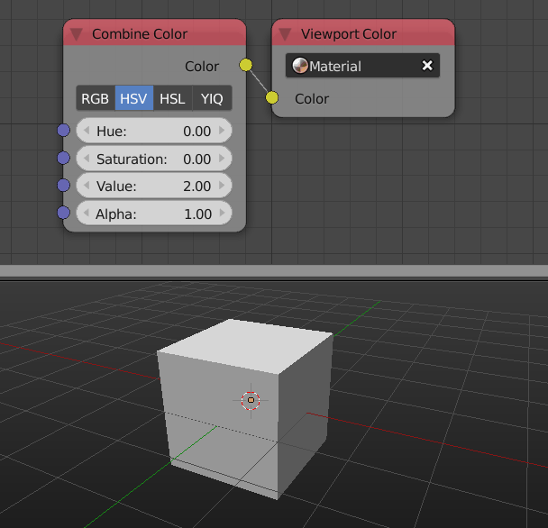

Viewport Color
==============

Description
-----------
This node lets you set the viewport color of the selected material. It works for both cycles and internal materials.

.. image:: images/viewport_color_node.png
   :width: 160pt

Inputs
------

- **Color** - The viewport color.

Outputs
-------

- N/A

Advanced Node Settings
----------------------

- N/A

Examples of Usage
-----------------

