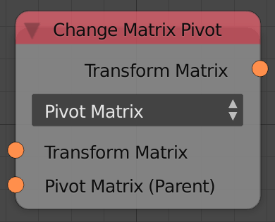
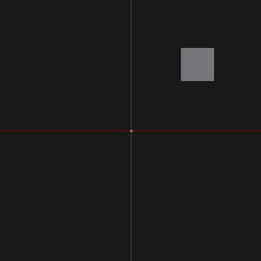
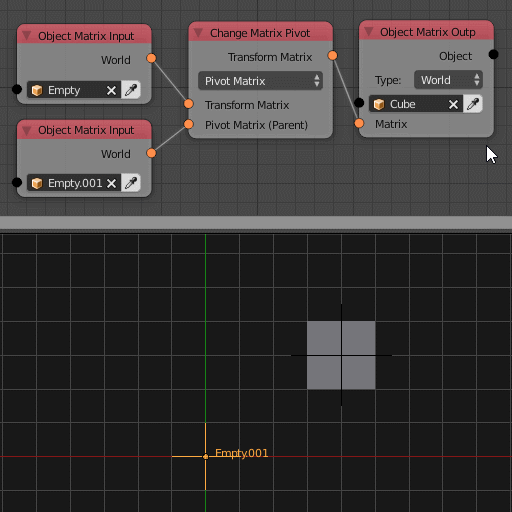
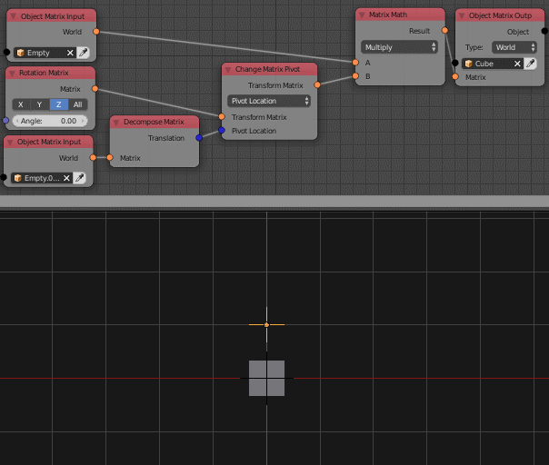
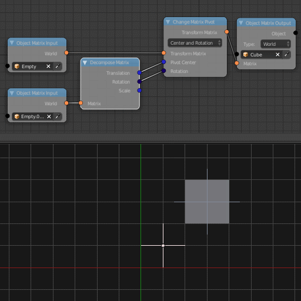
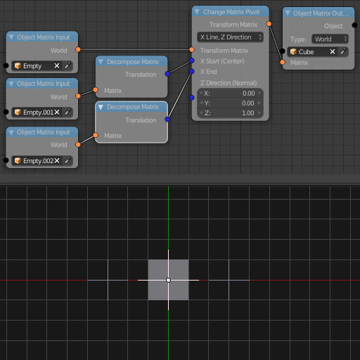
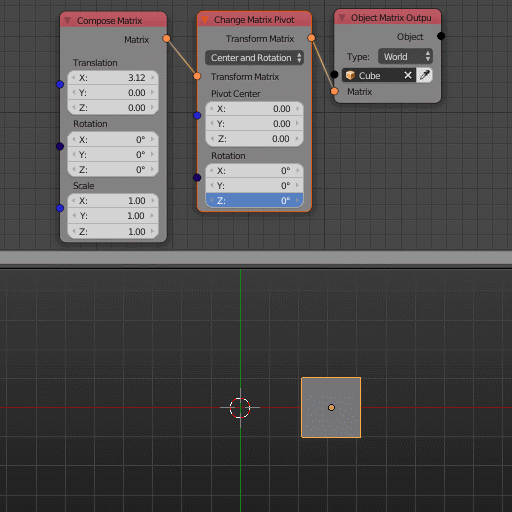

Change Matrix Pivot
===================

Description
-----------
This node includes 5 operations which are combined transformations that allow
you to change the pivot of the input transformation matrix.

Demonstration
-------------

Technically there is no such thing as a **Pivot** in mathematics. There is a constant
pivot which is the **Origin** (point ``(0,0,0)``) of the coordinates space.
However we can perform a fake transformation to change the pivot of the original transformation.

**Example**: Suppose we have a cube at position ``(2,2,0)``, if you multiplied
the matrix of the cube by a **Z axis rotation transformation matrix**, the cube
will rotate around the origin point which is ``(0,0,0)`` and its location will
linearly change relative to that origin.

Suppose we want the pivot of the transformation to be ``(2,2,0)`` which is the
same location as the cube. We said before that the pivot for any transformation
is constant and can never be changed. Mathematicians thought about that and said
>"If we can't move the pivot to the object why not move the object to the pivot,
do the transformation and move it back".

So the solution become clear, if we have an object at ``(2,2,0)`` and we want the
origin to be at ``(2,2,0)`` then we move the object to the origin which is defined
mathematically as **subtracting** do the transformation and move it back to where
it was which is defined mathematically as **adding**.

In Animation nodes the pivot is a bit different. Since the location of the object
is stored in the *Homogeneous Coordinates Transformation Matrix*, its pivot exists
in the objects local space coordinates.

Options
-------

- **Pivot Matrix**
    This option allows you to change the pivot using a transformation matrix. This
    will aloow you to set a parent child relation between the matrix and the pivot
    matrix. The location of the pivot matrix does not affect the pivot but the
    rotation and the scale does relative to the point ``(0,0,0)``.

- **Pivot Location**
    This option will let you choose the location of the pivot in 3D space.
    Notice that the original pivot location is in the local space so if you want
    to better unserstand how this node works, match the pivot of the world space
    coordinates and the local space coordinates by placing the object at the point ``(0,0,0)``.

- **Center And Rotation**
    This option allows you to change the pivot in the local space coordinates as
    well as a built in rotation around the pivot of the world space coordinates.
    Notice that that pivot of the local space coordinates is relative to the
    difference in the world space coordinates.

- **X Line,Z Direction**
    This option allows you to set the location of the pivot and orient the
    local space of the transformation matrix to a specific orientation based
    on 2 vectors. A point that make a vector with the origin which define the
    x axis of the local space and a normal vector whic correspond to the local
    z axis of the local space. The default value for the normal vector is the
    ``(0,0,1)`` which aligns the the local Z axis with the global Z axis which
    is the standard orientation, however if you change the the normal to be
    ``(1,0,0)`` this means you are aligning the local Z axis with the global
    X axis which means a rotation around the Z axis actually correspond to a
    rotation around the X axis.

- **X Line, Z line**
    This is exactly like **X Line,Z Direction** explained above, but instead of
    the normal vector you have a line that defines the Z orientation.

Inputs
------

- **Transformation matrix** - A transformation matrix to change its pivot.

(Inputs are based on the type of the node)

Outputs
-------

- **Transformation matrix** - The transformation matrix after pivot change.

Advanced Node Settings
----------------------

- N/A

Examples of Usage
-----------------

