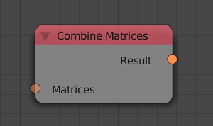
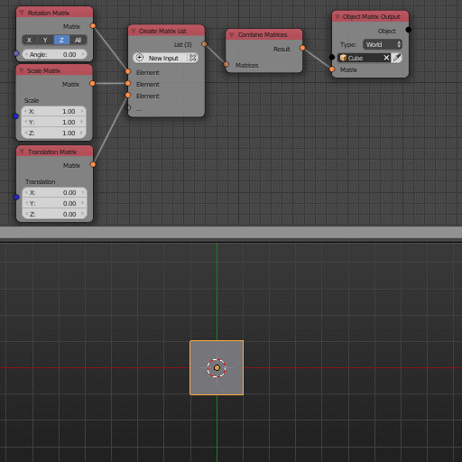

Combine Matrices
================

Description
-----------

This takes a list of transformation matrices and multiplies them together in order.

Inputs
------

- **Matrices** - A list of matrices.

Outputs
-------

- **Result** - The combined transformation matrix.

Advanced Node Settings
----------------------

- N/A

Examples of Usage
-----------------

