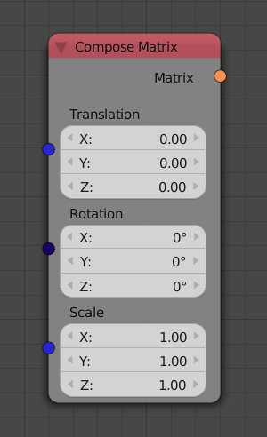
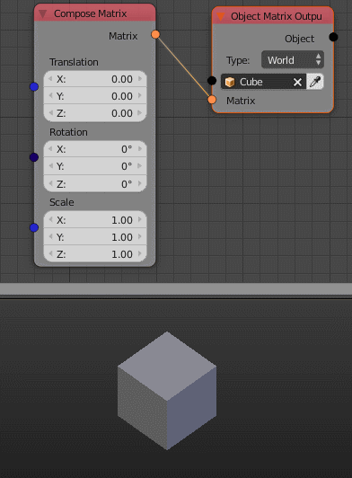

Decompose Matrix
================

Description
-----------
This node forms a 4x4 transformation matrix based on input translation,rotation and scalling.

Inputs
------

- **Translation**
    A vector that stores the amount of translation of the output matrix, which is
    also the location of the object.
- **Rotation**
    An euler that stores the amount of rotation of the output matrix, which is
    also the rotation of the object.
- **Scale**
    A vector that stores the amount of scaling of the output matrix, which is also
    the scale of the object.

Outputs
-------

- **Matrix**
    A 4x4 transformation matrix which can be used to apply linear transformations
    to an object.

Advanced Node Settings
----------------------

- N/A

Examples of Usage
-----------------

