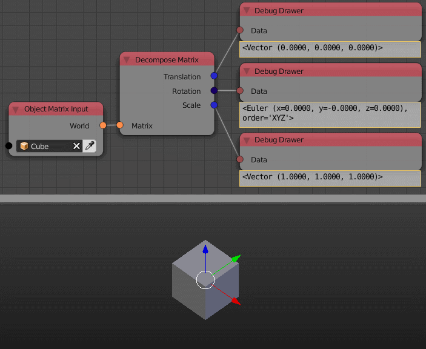

Decompose Matrix
================

Description
-----------
This nodes takes a 4x4 transformation matrix and returns its components including
rotation, translation and scale.

.. image:: images/decompose_matrix_node.png
   :width: 160pt

Demonstration
-------------

In CG applications object's location, rotation and scale are stored in what is
knows as the **Homogeneous Coordinates Transformation Matrix**.

**Homogeneous Coordinates Transformation Matrix** is a 4x4 matrix where the rotation
information is stored in the initial 3x3 matrix, location information stored in the
first 3 rows of the last column and scale information stored in the diagonal of
the initial 3x3 matrix.

To rotate, translate or scale this object or point, you have to edit this 4x4 matrix
in a special way.

To rotate the point you have to multiply the matrix by a special matrix called
the **Rotation Transformation Matrix**, and this multiplication will result a
new matrix representing the rotated point which is the the same as the original
matrix but with the initial 3x3 matrix changed.

To translate the point you have to multiply the matrix by a special matrix called
the **Translation Transformaton Matrix**, and this multiplication will result a
new matrix representing the translated point which is the same as the original
matrix but with the first 3 rows of the last column changed.

To scale the point you have to multiply the matrix by a special matrix called
the **Scaling Transformation Matrix**, and this multiplication will result a new
matrix representing the scalled point which is the same as the original matrix
but with the diagonal of the initial 3x3 matrix amplified by a specific factor.

Hopefully we don't have to perform any of the previous multiplication because
**Animation nodes** provided us with a set of node and operation to do those
linear transformations.

Notice what happen to the values of the matrix when applying a specific type of
transformation as explained above. Notice which elements are changing.

.. image:: gifs/decompose_matrix_node_demonstration.gif

Inputs
------

- **Matrix** - A matrix to decompose.

Outputs
-------

- **Translation**
    A vector that store the amount of translation in the input matrix, which is
    also the location of the object.
- **Rotation**
    An euler that store the amount of rotation in the input matrix, which is
    also the rotation of the object.
- **Scale**
    A vector that store the amount of scalling in the input matrix, which is
    also the scale of the object.

Advanced Node Settings
----------------------

- N/A

Examples of Usage
-----------------

