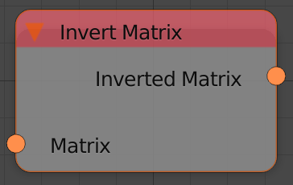
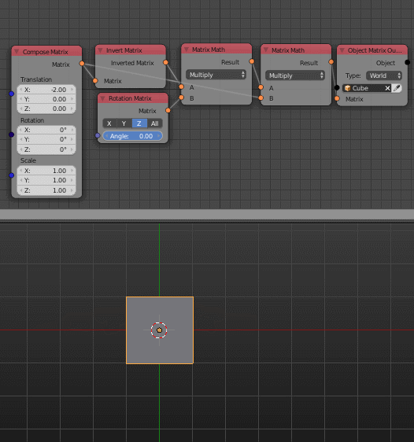

Invert Matrix
=============

Description
-----------

This node inverts the input transformation matrix. In other words, this node will return a matrix that reverses the effect of the input matrix. If the matrix is multiplied by its inverse, the result will be an identitie matrix.

Inputs
------

- **Matrix** - A transformation matrix to invert.

Outputs
-------

- **Inverted Matrix** - The inverted matrix.

Advanced Node Settings
----------------------

- N/A

Examples of Usage
-----------------

