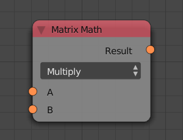
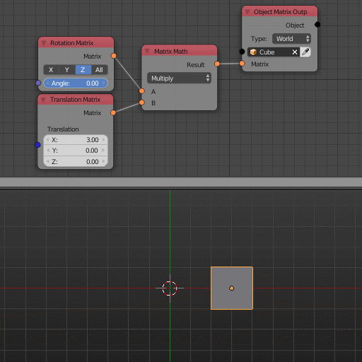

Matrix Math
===========

Description
-----------
This node allows you to multiply 2 transformation matrices.
Multiplying transformation matrices gets you a transformation matrix that will
perform all the input transformation matrices. So if you multiplied a rotation
matrix by a translation matrix the resultant matrix is a transformation matrix that
performs rotation and then translation.

Keep in mind that matrix multiplication is non commutative.

Inputs
------

- **A** - A transformation matrix.
- **B** - A transformation matrix.

Outputs
-------

- **Result** - The combined transformation matrix.

Advanced Node Settings
----------------------

- N/A

Examples of Usage
-----------------

