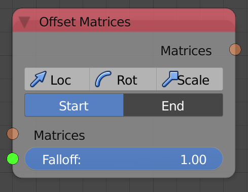

Offset Matrices
===============

Description
-----------

This node offset a matrix based on an input offset translation, rotation and scale with an input falloff as a factor.

Options
-------

- **Loc/Rot/Scale** - Enables location, rotation, scales offset.
- **Start/End** - Start will offset the matrices based on the offset parameters with the falloff as a factor. End will offset the matrices based on the offset parameters with the inverse falloff as a factor, in other words, all matrices will be transformed based on the offset parameters and then matrices will be transformed back to their initial position based on the offset parameter with the falloff as a factor.

Inputs
------

- **Matrices** - The matrices to offset.
- **Falloff** - A falloff to use as a factor.
- **Translation** - The offset translation vector.
- **Rotation** - The offset rotation euler.
- **Scale** - The offset scale vector.

Outputs
-------

- **Vector** - The new matrices after offset.

Advanced Node Settings
----------------------

Translation
^^^^^^^^^^^

- **Global Axis** - This option translate matrices in global space.
- **Local Axis** - This option translate matrices in local space, in other words, the translation vector is rotated based on the rotation of the transformation matrix before it get added.

Rotations
^^^^^^^^^

- **Global Axis - Global Pivot** - This option rotate matrices in global space around the space's origin point. Use it when your matrix represent a vector.
- **Global Axis - Local Pivot** - This option rotate matrices in global space around their origin point. Use it when you matrix represent an object and you want to transform in around its origin.
- **Local Axis - Local Pivot** - This option rotate matrices in local space around their origin point. Use it when you matrix represent an object and you want to transform in around its origin.

Scale
^^^^^

- **Local Axis** - This option scale matrices in their local space. Use this option if your matrices represent objects and you want to scale them without changing their position.
- **Global Axis** - This option scale matrices in global space. Use this option if your matrices represent objects and you want to scale them without changing their position.
- **Include Translation** - This option scale matrices in global space. Use this option if you want to scale them while changing their position.
- **Translation Only** - This option scale matrices in global space. Use this option if you want only location to change.

Examples of Usage
-----------------

.. image:: gifs/offset_matrices_node_example.gif
