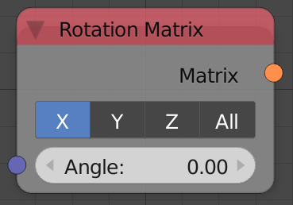
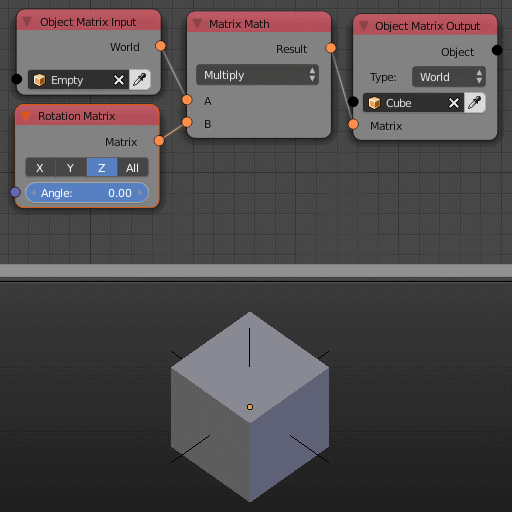

Rotation Matrix
===============

Description
-----------
This node generates a rotation transformation matrix based on an input euler or angle.
The transformation matrix can then be multiplied to a matrix to perform the rotation.

Inputs
------

- **Angle** - The amount of rotation in radian.

Note that the input may be an **euler** if the rotation matrix is generated for all axis.

Outputs
-------

- **Matrix** - A transformation matrix that carry the rotation information.

Advanced Node Settings
----------------------

- N/A

Examples of Usage
-----------------

