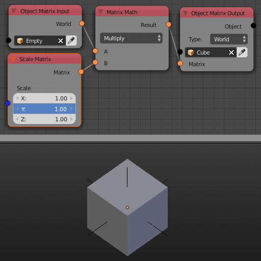

Scale Matrix
============

Description
-----------
This node generates a scale transformation matrix based on an input vector.
The transformation matrix can then be multiplied to a matrix to perform the scalling.

.. image:: images/scale_matrix_node.png
   :width: 160pt

Inputs
------

- **Scale** - A vector that store the amount of scalling in the output transformation matrix.

Outputs
-------

- **Matrix** - A transformation matrix that carry the scale information.

Advanced Node Settings
----------------------

- N/A

Examples of Usage
-----------------

