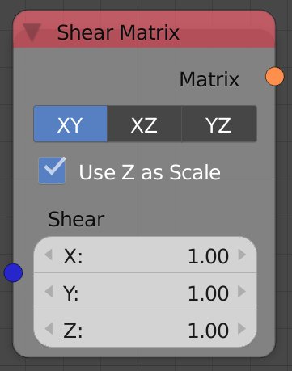
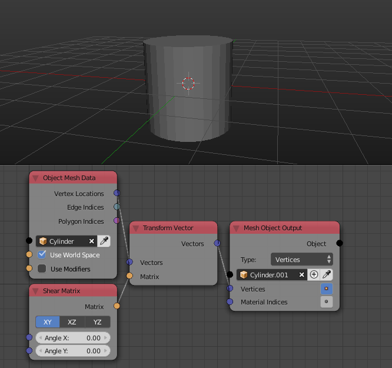

Shear Matrix
============

Description
-----------
This node generates a shear transformation matrix based on an input vector.
The transformation matrix can then be multiplied to a matrix to perform the shearing.

Shearing is changing the coordinates of an axis based on the coordinates of another
axis using a tangent relationship.

This node will enable you to choose 2 of the axis to edit based on their third
axis where the effect of each axis is controled using the input vector.

There is also an option to change the factor of shearing using the third axis since it is not used.

Inputs
------

- **Shear** - A vector that store the amount of shearing in the output transformation matrix.

Outputs
-------

- **Matrix** - A transformation matrix that contains the shearing information.

Advanced Node Settings
----------------------

- N/A

Examples of Usage
-----------------

