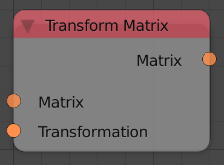
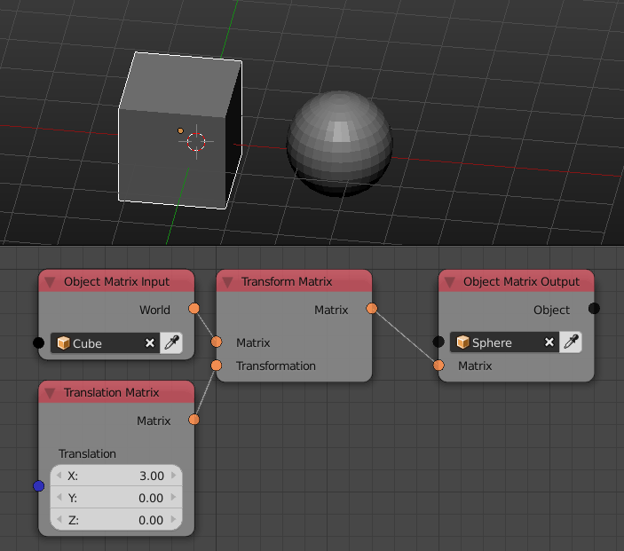

Transform Matrix
================

Description
-----------

This node transform the input matrix by the the input transformation matrix.

Inputs
------

- **Matrix** - A matrix to transform.
- **Transformation** - A transformation matrix.

Outputs
-------

- **Matrix** - The transformed matrix.

Advanced Node Settings
----------------------

- N/A

Examples of Usage
-----------------

