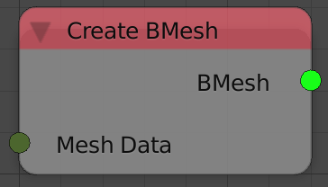

Bmesh From Mesh Data
====================

Description
-----------
This node converts a mesh data block into a Bmesh block.

Inputs
------

- **Mesh Data** - Mesh data to convert.

Outputs
-------

- **Bmesh** - The resulted Bmesh.

Advanced Node Settings
----------------------

- N/A

Examples of Usage
-----------------

.. image:: gifs/bmesh_from_mesh_data_node_example.gif
