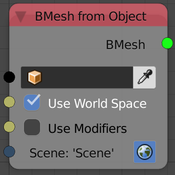

Bmesh From Object
=================

Description
-----------
This node return a bmesh data type for the input object.

A bmesh data type is created using blender's bmesh python module which support operations that can't be performed normally in bpy module and thus can't be applied on a normal mesh data type, some of this operations are implimented in AN like **Limited Dissolve** and **Remove Doubles**.

It is not recommended to use this node if you are not going to use bmesh operations and just want to get mesh data, because it is a lot slower to create.(Object Mesh Data node can get the same data in about 33x the speed of the bmesh)

Inputs
------

- **Object** - An object.
- **Use World Space** - This option allow you to choose between local and global coordiate space for the output vectors (vertices location).
- **Use Modifiers** - This option if enabled will return the data as modifiers were applied, that include both the generative and defomative modifiers.
- **Scene** - `To Do`

Outputs
-------

- **Bmesh** - A bmesh data type.

Advanced Node Settings
----------------------

- N/A

Notes
-----

- Using Bmesh doesn't mean that the info will be updated on the fly when you are in edit mode editing, you will have to change to object mode to update the edits you applied.

Examples of Usage
-----------------

.. image:: gifs/bmesh_from_object_node_example.gif
