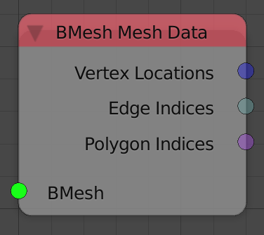
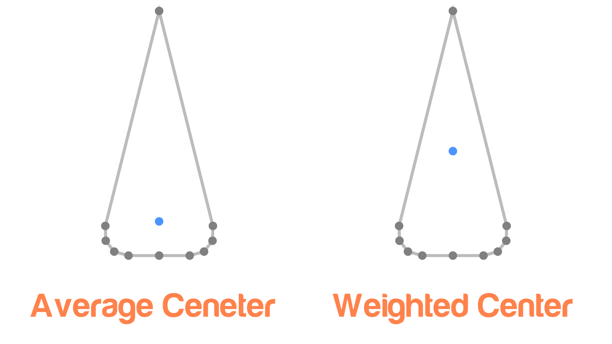
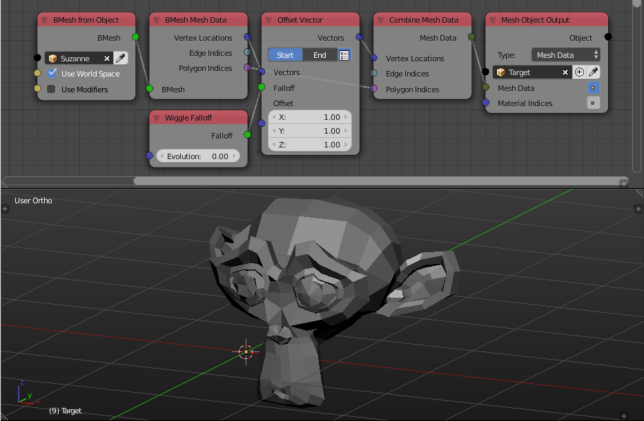

Bmesh Mesh Data
===============

Description
-----------
This node return the mesh data of the input bmesh.

Inputs
------

- **Bmesh** - A bmesh.

Outputs
-------

- **Vertex Locations** - A vector list that include vertices locations of the input bmesh.
- **Edge Indices** - A list of edge indices that include all the edges of the input bmesh.
- **Polygon Indices** - A list of polygon indices that include all the polygons of the input bmesh.
- **Vertices** - A list of vertex data for each vertex in the input bmesh. (see notes)
- **Polygons** - A list of polygon data for each polygon in the input bmesh. (see notes)

Advanced Node Settings
----------------------

**Weighted Center** - The polygons data type carry a vector that represent the the center of the polygon.
If this option is disabled, the center is basically the average of the vertices locations of the polygon, or in more mathematical word, The scalars of the convex combination of the vertices of the polygon are all equal and is equal to the reciprocal of the number of vertices in that polygon.
If this option is enabled, the scalars of each vertex of the convex combination of the vertices of the polygon will be directly proportional to the length of the two edges it is connected to.
This option solve dispersion issue, where if we had a polygon that consist of 10 vertices, 9 of them are in a small area and one of them is far away, the average ceneter will be so close to the 9 vertices and very far from the single vertex, however the weighted center will have a center at equal distance from both the single and the 9 vertices.

Notes
-----

- **Vertices** output is a data type that carry more information about the vertex like its normal and its weight in vertex groups and you can get them using the **Vertex Info** node, so if all you want is the location of the vertices then the **Vertex Location** output is the right output for the job.And the same apply for **Polygons**.

Examples of Usage
-----------------

