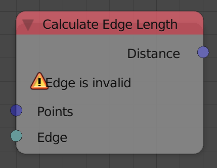
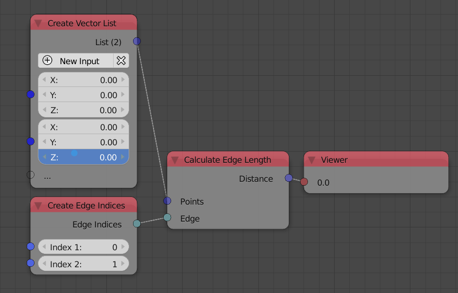

Calculate Edge length
=====================

Description
-----------

This node compute the length of an edge.

Inputs
------

- **Points** - A vector list that represent the vertices locations of the edge.
- **Edge** - An edge indices that define the edge.

Outputs
-------

- **Distance** - The distance between the two points that form the input edge.

Advanced Node Settings
----------------------

- N/A

Examples of Usage
-----------------

