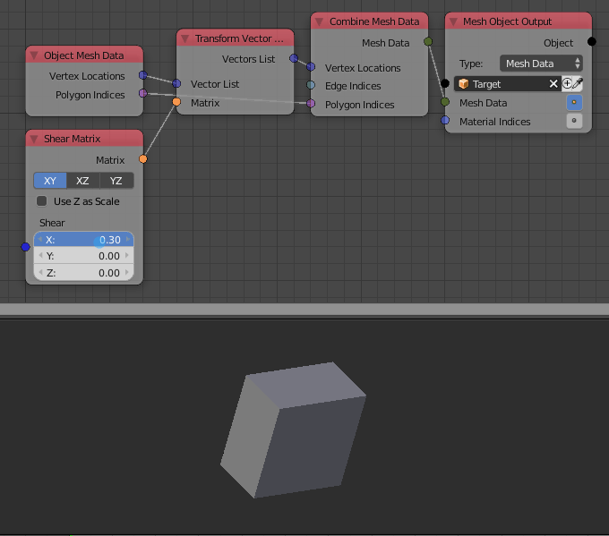

Combine Mesh Data
=================

Description
-----------
This node combine individual mesh data into a mesh data block.

.. image:: images/combine_mesh_data_node.png
   :width: 160pt

Inputs
------

- **Vertex Locations** - A vector list that contain the locations of the vertices of the input mesh data.
- **Edges Indices** - An edge indices list that contain the edge information of the input mesh data.
- **Polygons Indices** - A polygon indices list that contain the polygon information of the input mesh data.

Outputs
-------

- **Mesh Data** - A mesh data.

Advanced Node Settings
----------------------

- N/A

Examples of Usage
-----------------

