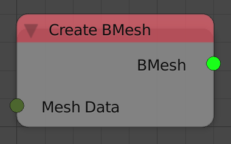

Create Bmesh
============

Description
-----------

This node converts a mesh data into a Bmesh.

Inputs
------

- **Mesh Data** - Mesh data to convert.

Outputs
-------

- **Bmesh** - The resulted Bmesh.

Advanced Node Settings
----------------------

- N/A

Examples of Usage
-----------------

.. image:: gifs/create_bmesh_node_example.gif
