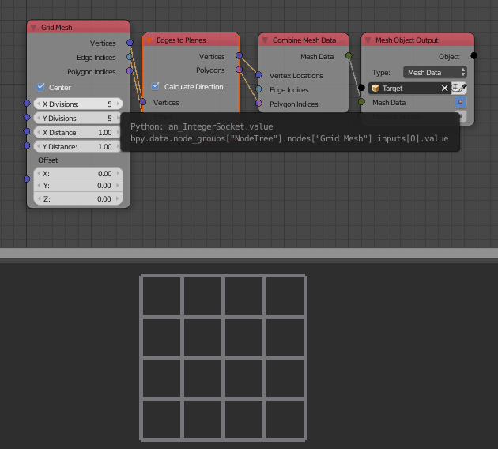

Grid
====

Description
-----------
This node return the mesh data of a 2d grid based on the input data.

This node has an option **"Center"** which is enabled by default, when center is enabled the grid is centered in the world, when it is not, the grid start at the center and spread in the first quadrant.

.. image:: images/line_node.png
   :width: 160pt

Inputs
------

- **X Divisions** - The number of lines in the x direction.
- **Y Divisions** - The number of lines in the y direction.
- **X Distance** - The distance between lines in x direction.
- **Y Distance** - The distance between lines in y direction.
- **Offset** - A vector that define the location of the grid.

Outputs
-------

- **Vertices** - The vertices locations of the grid.
- **Edge Indices** - The edge indices of the grid.
- **Polygon Indices** - The polygon indices of the grid.

Advanced Node Settings
----------------------

- N/A

Examples of Usage
-----------------

