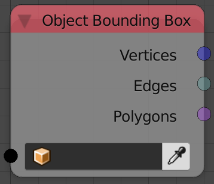

Get Bounding Box
================

Description
-----------
This node return mesh data of a cuboid that represent the bounding box of the input object.

A bounding box is a box that bound the object, that is, each face of the box is a least upper bound or greatest lower bound of a specific vertex coordinate.

Inputs
------

- **Object** - An object.

Outputs
-------

- **Vertices** - A vector list that include vertices locations of the bounding box.
- **Edges** - A list of edge indices that include all the edges of the bounding box.
- **Polygons** - A list of polygon indices that include all the polygons of the bounding box.

Advanced Node Settings
----------------------

- **Use World Space** - This option allow you to choose between local and global coordinate space for the bounding box.

Examples of Usage
-----------------

It is not every day where you would create a bounding box or visualize it. This node is useful as it actually gives you the ability to determine the maximum and minimum value of the vertex coordinates at a certain axis, and you may use it to perform normalization for instance.

In other words, if I were to calculate the x coordinate of the vertex that has the highest x coordinate (The maximum x value of all vertices) I can just get the x coordinates of the vertex at index 6---It represent the intersection of the least upper bounds in all axis so its x coordinate is the maximum x and its y is the maximum y and its z is the maximum z---The same apply for the minimum but this time the vertex at index zero is sampled.
