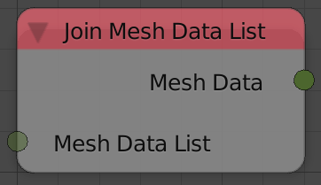
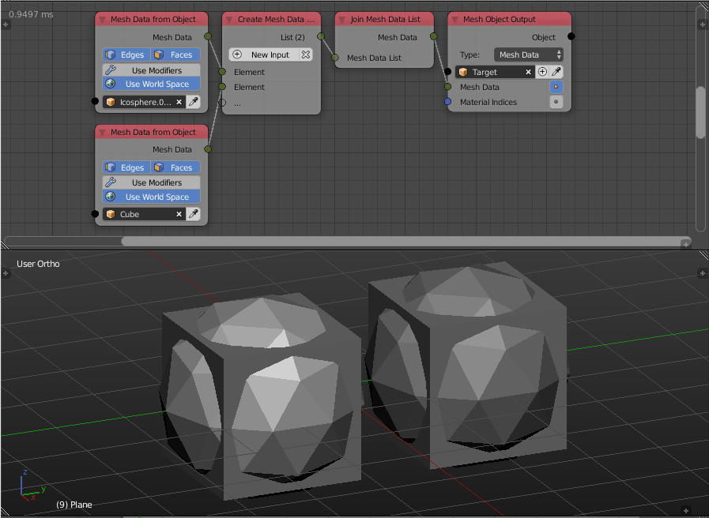

Join Mesh Data List
===================

Description
-----------
This node combine multiple mesh data blocks into a single block of mesh data.

Inputs
------

- **Mesh Data List** - A list of mesh data to join.

Outputs
-------

- **Mesh Data** - The joined mesh data.

Advanced Node Settings
----------------------

- N/A

Examples of Usage
-----------------

