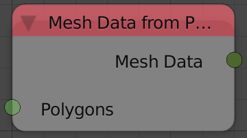

Mesh Data From Polygons
=======================

Description
-----------
This node create mesh data block from a list of polygons.

You may think that this node create mesh data from just polygons, but in fact, the polygon data block contain the vertices locations that create each polygon, however, indices are not provided so the resulted mesh data will have faces that are separated from each other.

Inputs
------

- **Polygons** - A list of polygon data.

Outputs
-------

- **Mesh Data** - The mesh data of the resulted mesh.

Advanced Node Settings
----------------------

- N/A

Examples of Usage
-----------------

.. image:: gifs/transform_polygon_node_example.gif
