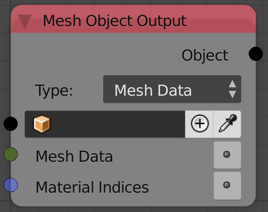
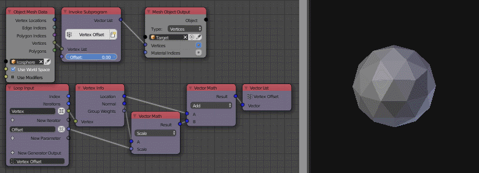

Object Output
=============

Description
-----------

This node edits the input object's data based on a new input data.

Options
-------

- **Mesh Data** - This option lets you write a mesh data to the input object. Since the mesh data block carries only the vertices locations, edge, indices, and polygons indices info, those will be the only data in the output object. (A bmesh data carries more information than the mesh data block like vertices normals.)
- **Bmesh** - This option lets you write a bmesh data to the input object. A bmesh data carry much more information than the mesh data, such extra information like *Vertex Normals*, *Vertex group weights* and *Material indices*.
- **Vertices** - This option will only edit the vertices locations, that is, the input object should already have some data and you are just editing the vertices locations of this data. This option is much faster than the **Mesh Data** option assuming all you do is edit the vertices.

Inputs
------

- **Object** - An object to edit. The plus button let you add a new object and write to it.
- **Mesh Data** - Mesh data to write to the input object. (Only for the Mesh Data option)
- **Bmesh** - Bmesh to write to the input object. (Only for the Bmesh option)
- **Vertices** - Vector list that represents the new locations for the vertices. (Only for the vertices option)
- **Material Indices** - An integer list, the first integer represent the index of the material of the first polygon, the 2nd integer represent the index of the material of the 2nd polygon, ....

Outputs
-------

- **Object** - The input object.

Advanced Node Settings
----------------------

- **Update Mesh** - If enabled, the two following options will appear, those options try to fix corrupt mesh data as much as possible to avoid blender crashing, but they slow down execution, so make sure to disable them if you are absolutely sure that you mesh data is valid:
    - **Recalculate Edges** - If enabled, AN will recompute edge data from polygon data to make sure they are correct.
    - **Recalculate Tessellation Faces** - If enabled, AN will recompute polygon data to make sure they are correct.
- **Validate Mesh** - ``To Do``

Examples of Usage
-----------------

