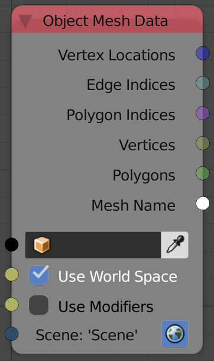

Object Mesh Data
================

Description
-----------
This node return some data about the input object like its vertices and polygons info. The data is from blender's object data block, which means, when the object is edited in edit mode, **AN** won't update the output data unless you change to object mode.

Options
-------

- **Use World Space** - If enabled, will return the vertices locations in the world space, while in local space otherwise.
- **Use Modifiers** - If enabled, will return the object information after modifiers are applied.

Inputs
------

- **Object** - An object.
- **Use World Space** - This option allow you to choose between local and global coordiate space for the output vectors (vertices location).
- **Use Modifiers** - This option if enabled will return the data as modifiers were applied, that include both the generative and defomative modifiers.
- **Scene** - `To Do`

Outputs
-------

- **Vertex Locations** - A vector list that include vertices locations of the input object.
- **Edge Indices** - A list of edge indices that include all the edges of the input object.
- **Polygon Indices** - A list of polygon indices that include all the polygons of the input object.
- **Vertices** - A list of vertex data for each vertex in the input object. (see notes)
- **Polygons** - A list of polygon data for each polygon in the input object. (see notes)
- **Mesh Name** - A string that contain the name of the mesh.

Advanced Node Settings
----------------------

- N/A

Notes
-----

- **Mesh Name** output is not the object name! It the the name of mesh data block that define the geometry of the object. In blender you can find that name in the *Data Panel*.
- **Vertices** output is a data type that carry more information about the vertex like it's normal and it's weight in vertex groups, you can get those information using the **Vertex Info** node, so if all you want is the location of the vertices then the **Vertex Location** output is the right output for the job.
And the same apply for **Polygons**.

Examples of Usage
-----------------

.. image:: gifs/object_mesh_data_node_example.gif
