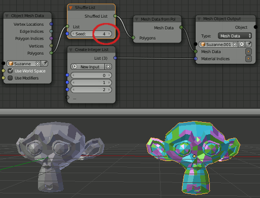

Mesh Object Output
==================

Description
-----------
This node assigns the input data (Vertices/BMesh/Mesh Data) to the given or selected object.
Additionally it's possible to set the material indices of the faces.

.. image:: images/mesh_object_output.png

Inputs
------

- **Object** - The object the output is assigned to.
- **Vertices / BMesh / Mesh Data** - *Data Input* depending on the selection in the *Type* option.
- **Material Indices** - *Integer List* of material indices. If the given material indices list is smaller than the face count, the list is looped over the faces.

Outputs
-------
- **Object** The assigned object.

Advanced Node Settings
-----------------------

- N/A

Examples of Usage
-----------------

