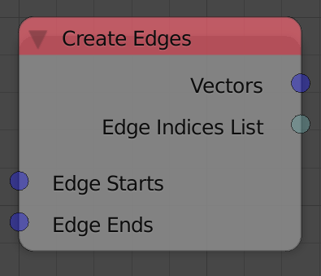
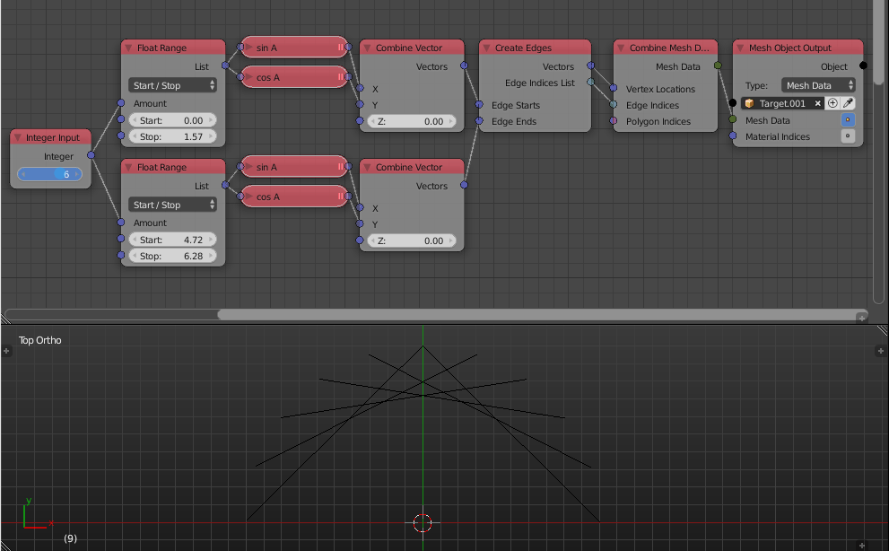

Create Edges
============

Description
-----------

This node creates edges based on two vectors lists that define the locations of the terminals of the edges.

Inputs
------

- **Edge Starts** - A vector list that represent the vertices locations of the starts of the edges.
- **Edge Ends** - A vector list that represent the vertices locations of the ends of the edges.

Outputs
-------

- **Vectors** - A vector list that represent the vertices locations of the edges.
- **Edge Indices** - Edges indices that describe the connection between each corresponding vectors.

Advanced Node Settings
----------------------

- N/A

Examples of Usage
-----------------

