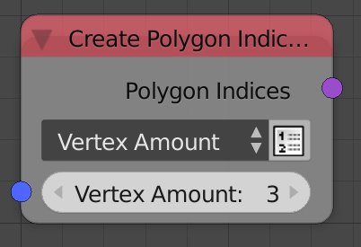
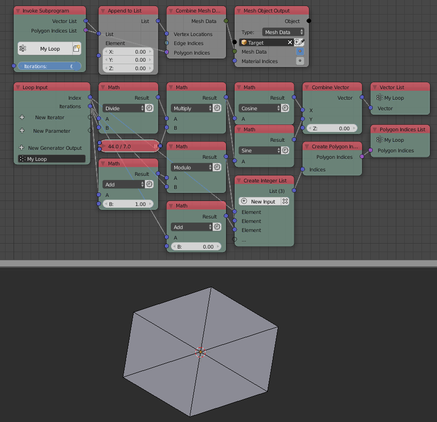

Create Polygon Indices
======================

Description
-----------
This node create a polygon indices which then can be used to create a polygon indices list to create objects.

Inputs
------

- **Indices** - An integer list that contain all the indices of the vertices that form the polygon.

Outputs
-------

- **Polygon Indices** - The resulted polygon indices.

Advanced Node Settings
----------------------

- N/A

Examples of Usage
-----------------

