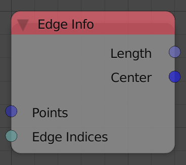
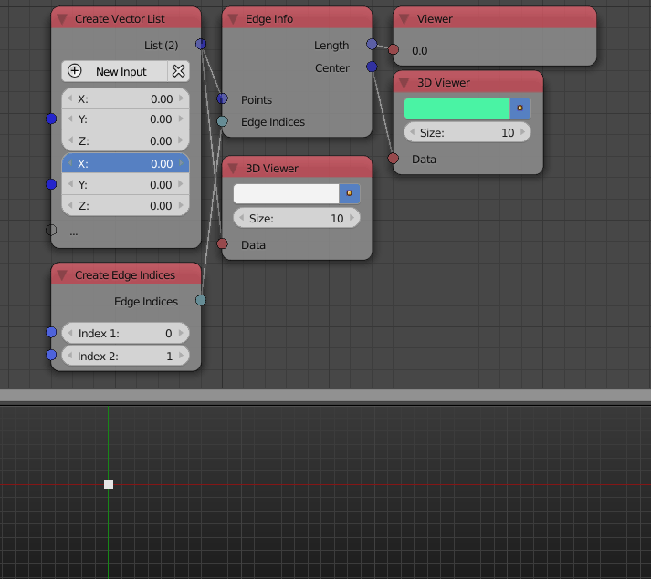

Edge Info
=========

Description
-----------

This node return some info about the input edge(s).

Inputs
------

- **Points** - The locations of the vertices of the edge(s).
- **Edge Indices** - The edge indices of the edge(s).

Outputs
-------

- **Length** - The length(s) of the input edge(s).
- **Center** - The center(s) of the input edge(s).

Advanced Node Settings
----------------------

- N/A

Examples of Usage
-----------------

