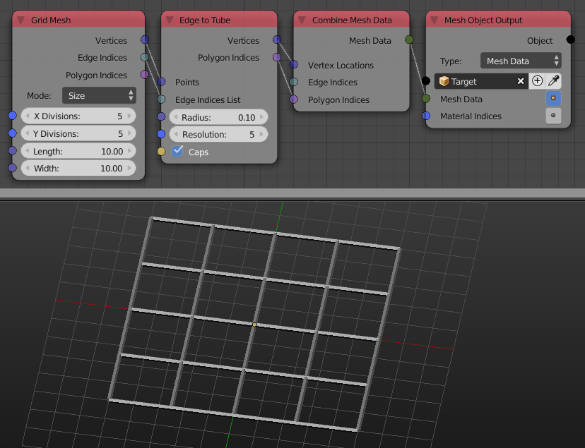

Edge To Tube
============

Description
-----------

This node returns the mesh data of a mesh composed of cylinders in places of the input edges.

.. image:: images/edge_to_tube_node.png
   :width: 160pt

Inputs
------

- **Points** - The locations of the vertices of the edges.
- **Edge Indices List** - The edge indices list of the edges.
- **Radius** - Radius of the cylinders.
- **Resolution** - The number of vertices per loop that forms the cylinder.
- **Caps** - If true, cylinders' starts and ends will be closed using an Ngon.

Outputs
-------

- **Vertices** - The vertices locations of the cylinders.
- **Polygon Indices** - The polygon indices of the cylinders.

Advanced Node Settings
----------------------

- N/A

Examples of Usage
-----------------

