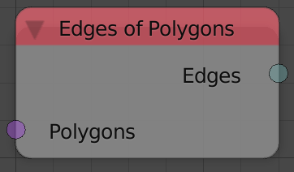
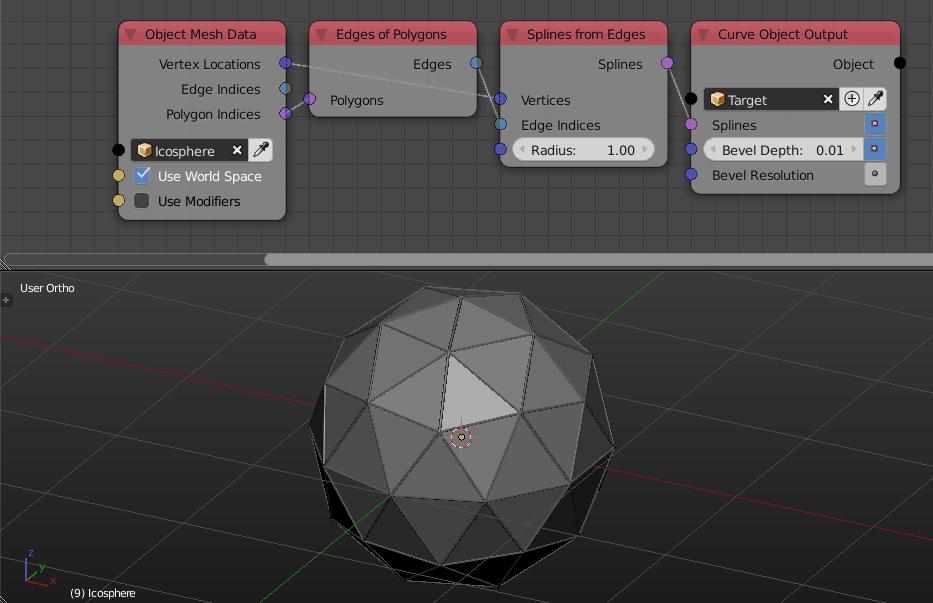

Edges Of Polygons
=================

Description
-----------
This node return the edge indices data of the input polygon. Vertices that shared the same polygon are going to share the same edges of the polygon as well.

Inputs
------

- **Polygons** - An input polygons.

Outputs
-------

- **Edges** - The edges indices of the input polygons.

Advanced Node Settings
----------------------

- N/A

Examples of Usage
-----------------

