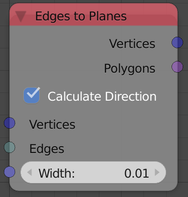
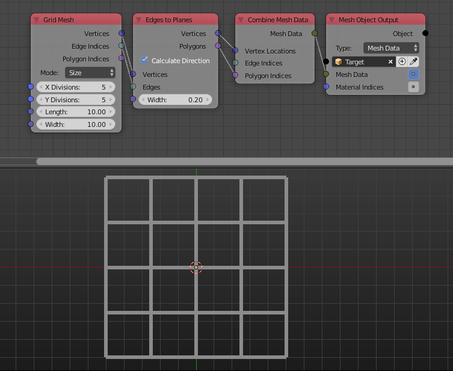

Edges To Planes
===============

Description
-----------
This node create planes in places of the edges of the input mesh data (possibly vertices and edges data only as polygons are not required).

Options
-------

- **Calculate Direction** - If enabled, it will align the terminals of each plane to be perpendicular to the edge direction and thus having a rectangular shape, if disabled, the terminals of the plane will be aligned to the x axis and thus having a parallelogram shape.

Inputs
------

- **Vertices** - A vector list that contain vertices locations.
- **Edges** - An edge indices list.
- **Width** - The width of the created planes.
- **Up Vector** - A vector that represent the normal of the created planes. (The resulted normals will be radially similar to this vector as each edge has it's own orientation and they can't all have the same normal.)

Outputs
-------

- **Vertices** - The vertices locations of the planes.
- **Polygons** - The polygons indices list of the planes.

Advanced Node Settings
----------------------

- N/A

Examples of Usage
-----------------

