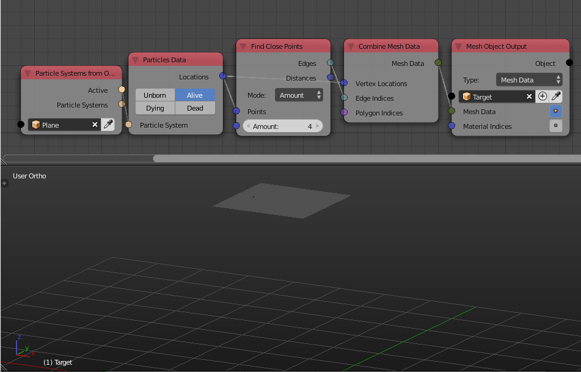

Find Close Vertices
===================

Description
-----------

This node takes a vector list (Usually represent the location of some points) and return edge indices list that represent some connection between those input points.

.. image:: images/find_close_points_node.png
   :width: 160pt

Options
-------

- **Amount** - This option lets you define the amount of connections that each point should have.
- **Distance** - This option lets you define a distance,  if the distance between a point and another is less that distance, a connections is initialized between them.

Inputs
------

- **Points** - A vector list that contain points locations.
- **Amount** - The amount of connections each point have. (Only available in the Amount option)
- **Max Distance** - The maximum distance each connection is allowed to have. (only available in the Distance option)

Outputs
-------

- **Edges** - An edge indices list that represent the connections.
- **Distances** - A float list that contains the lengths of the edges defined by the output edge indices and the input point locations.

Advanced Node Settings
----------------------

- N/A

Examples of Usage
-----------------

