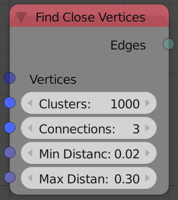
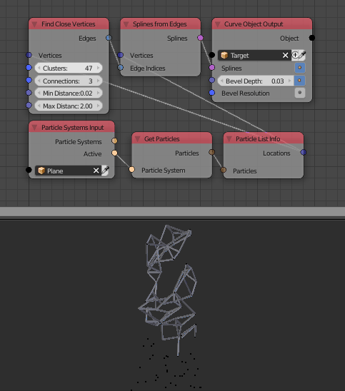

Find Close Vertices
===================

Description
-----------
This node takes a vector list (usually vertices locations) and return edge indices list that represent some connection between those input points.

The connections depend on the distances between the points and the node enable controlling the conditions of initializing each connection. (see inputs)

Inputs
------

- **Vertices** - A vector list that contain vertices locations.
- **Clusters** - The number of input vector to check for connections. (The node iterate over the input vector list checking for connections for every vector, however, if the Clusters value is smaller than the input list length, the node will only check for the first `n` element of the list where `n` is the Clusters value.)
- **Connections** - The maximum number of connections each vector(point) can have.
- **Min Distance** - The minimum distance each connection is allowed to have.
- **Max Distance** - The maximum distance each connection is allowed to have.

Outputs
-------

- **Edges** - An edge indices list that represent the connections.

Advanced Node Settings
----------------------

- N/A

Examples of Usage
-----------------

