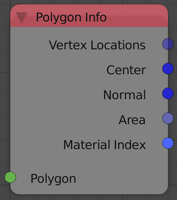

Polygon Info
============

Description
-----------
This node returns some information about the input polygon.

Inputs
------

- **Polygon** - A polygon.

Outputs
-------

- **Vertex Locations** - A vector list that contains the locations of all the vertices forming the input polygon.
- **Center** - A vector that represents the center of the polygon.
- **Normal** - A unit vector that represents the normal of the input polygon.
- **Area** - A float that represents the area of the input polygon.
- **Material Index** - An integer that represents the index of the material which the input polygon is assigned to.

Advanced Node Settings
----------------------

- N/A

Examples of Usage
-----------------

.. image:: gifs/bmesh_mesh_data_node_example.gif
