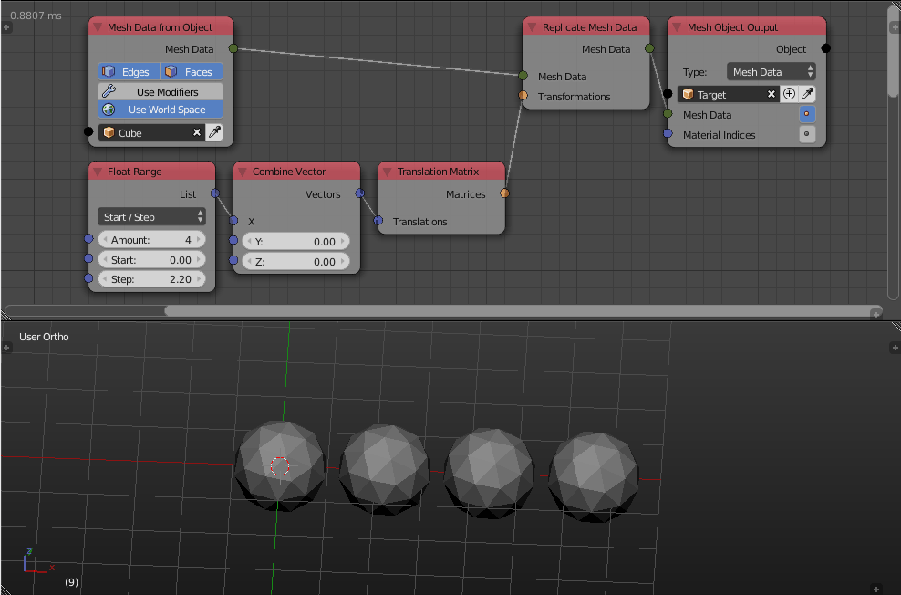

Replicate Mesh Data
===================

Description
-----------

This node copy the input mesh data multiple times, transforms them then combine them in a single mesh data.

.. image:: images/replicate_mesh_data_node.png
   :width: 160pt

Inputs
------

- **Mesh Data** - A mesh data to replicate.
- **Transformations** - A list of transformation matrices, where the length of this list represent the number of copies of the mesh data, each copied mesh data is then transformed based on the corresponding transformation matrix in this list.

Outputs
-------

- **Mesh Data** - The combined mesh data.

Advanced Node Settings
----------------------

- N/A

Examples of Usage
-----------------

