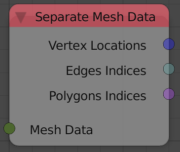

Separate Mesh Data
==================

Description
-----------
This node separates the input mesh data into it's components:

- **Vertex Locations**.
- **Edge Indices**.
- **Polygon Indices**.

Inputs
------

- **Mesh Data** - A mesh data to separate.

Outputs
-------

- **Vertex Locations** - A vector list that contains the locations of the vertices of the input mesh data.
- **Edges Indices** - An edge indices list that contains the edge information of the input mesh data.
- **Polygons Indices** - A polygon indices list that contains the polygon information of the input mesh data.

Advanced Node Settings
----------------------

- N/A
