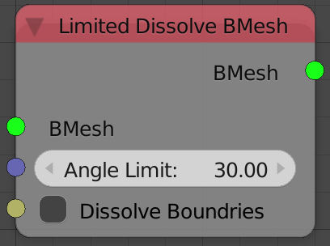
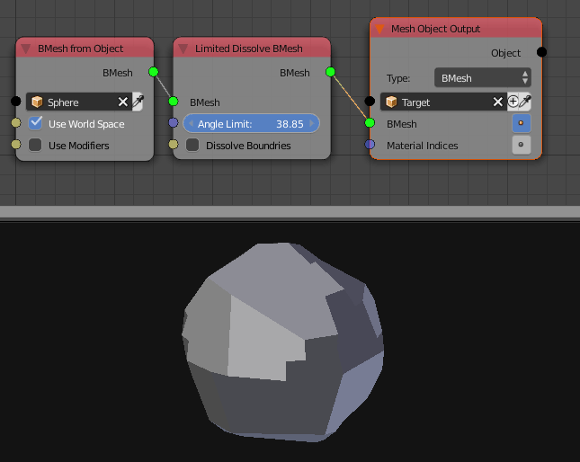

Limited Dissolve
================

Description
-----------
This node perform a **Limited Dissolve** bmesh operation on the input bmesh, this operation is similar if not identical to blender's limited dissolve operator.

**Limited Dissolve** dissolve the edges between faces which make an angle less than an input threshold.

Inputs
------

- **Bmesh** - An Input Bmesh.
- **Angle Limit** - The thresold for dissolving the edges. (If the angle between 2 faces is lower than this angle, the edge between them will be dissolved.)
- **Dissolve Boundries** - This option if enabled will dissolve vertices inbetween faces boundries.

Outputs
-------

- **Bmesh** - The resulted Bmesh.

Advanced Node Settings
----------------------

- N/A

Examples of Usage
-----------------

