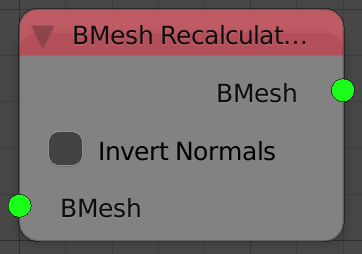

Recalculate Normals
===================

Description
-----------
This node recalculate the normals of vertices of the input bmesh.The node have an option to invert the recalculated normals.

It is often that the created mesh will have zero normals---The magnitude of the normals is zero---and you will have to recalculate the normals by using this node.

Inputs
------

- **Bmesh** - An Input Bmesh.

Outputs
-------

- **Bmesh** - The resulted Bmesh.

Advanced Node Settings
----------------------

- N/A
