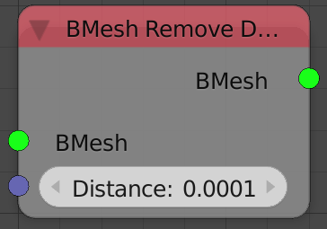
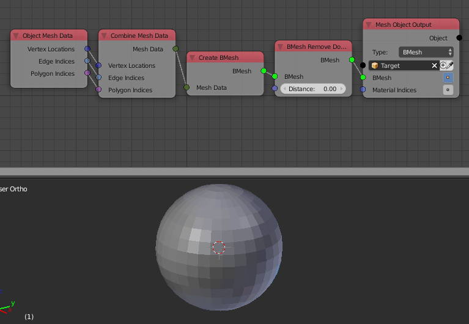

Remove Doubles
==============

Description
-----------

This node perform a **"Remove Doubles"** bmesh operation on the input bmesh, this operation is similar if not identical to blender's remove doubles operator.

**Remove Doubles** join vertices that are close in space and the threshold is defined by an input.

Inputs
------

- **Bmesh** - An Input Bmesh.
- **Distance** - The threshold for merging the vertices. (If the distance between 2 points is lower than this number, they will be joined)

Outputs
-------

- **Bmesh** - The resulted Bmesh.

Advanced Node Settings
----------------------

- N/A

Examples of Usage
-----------------

