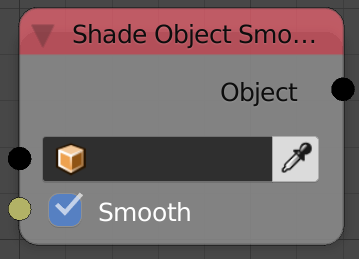
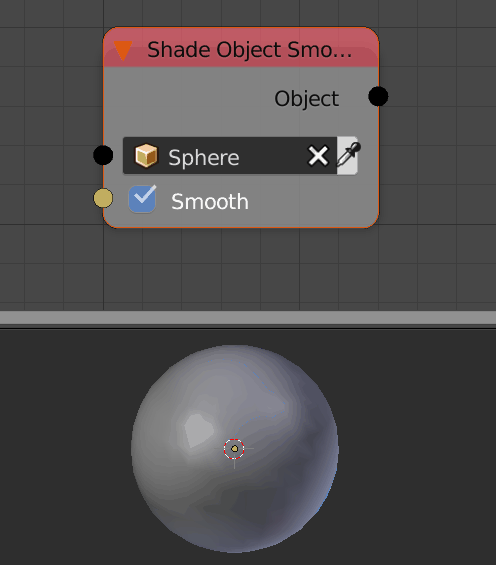

Shade Object Smooth
===================

Description
-----------

This node set the shading of the input object to smooth or flat.

Inputs
------

- **Object** - An Object.
- **Smooth** - A boolean which if True will shade the object smooth and if False will shade the object flat.

Outputs
-------

- **Object** - The input object.

Advanced Node Settings
----------------------

- N/A

Note
----

If you shaded an object smooth and it get rendered black, then its normals are null vectors and you will have to recalculate the normals using the *Recalculate Normals Node*.

Examples of Usage
-----------------

