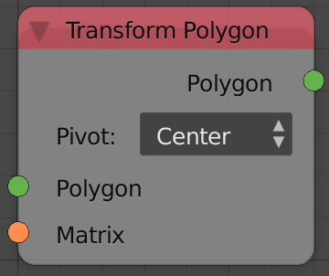
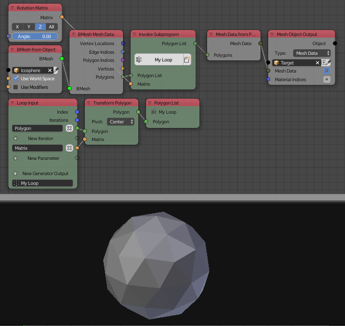

Transform Vector
================

Description
-----------
This node transforms an input polygon based on an input transformation matrix.

It supports using the **Center** of the polygon, the center of the **world** `(0,0,0)` and a **custom** vector as a pivot for the transformation

Inputs
------

- **Polygon** - A polygon.
- **Matrix** - A transformation matrix.
- **Pivot** - A vector to use as a pivot. (only when *Custom pivot* is choosen)

Outputs
-------

- **Polygon** - The transformed vector.

Advanced Node Settings
----------------------

- N/A

Examples of Usage
-----------------

