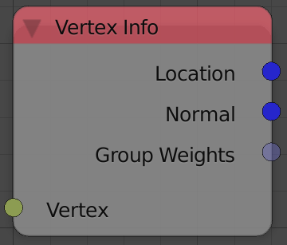

Vertex Info
===========

Description
-----------
This node returns some information about the input vertex.

Inputs
------

- **Vertex** - A vertex.

Outputs
-------

- **Location** - A vector that represents the location of the input vertex.
- **Normal** - A unit vector that represents the normal of the input vertex.
- **Group Weights** - A list of floats that represents the weight of the vertex in every vertex group it is assigned to. (see notes)

Advanced Node Settings
----------------------

- N/A

Notes
-----

The **Group Weights** output only returns the weights of the vertex groups the vertex is assigned to, which means a vertex group that the vertex is not assigned to will not be included in the list, to include it, you may want to assign it to the rest of the vertex groups with a weight of zero.

Examples of Usage
-----------------

.. image:: gifs/object_mesh_data_node_example.gif
