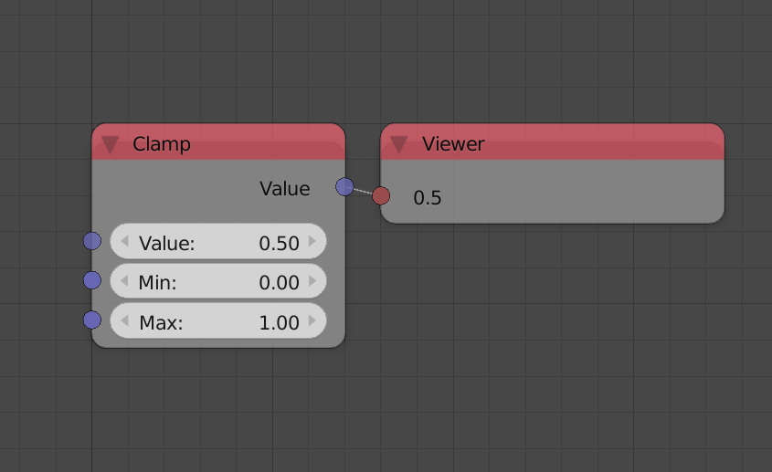
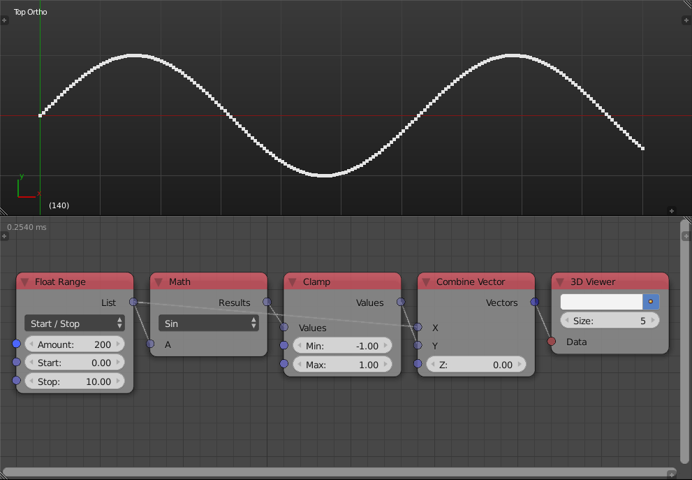

Clamp
=====

Description
-----------

This node clamps a value to a certain range. Any value outside of the defined range will be clamped, that is, if it is larger than the maximum value it will be rendered the maximum value and if it is less than the minimum value it will be rendered the minimum value.

.. image:: images/clamp_node.png
   :width: 160pt

Inputs
------

- **Value** - The input value for clamping.
- **Min** - If the input value is less than this value, the output will be this value.
- **Max** - If the input value is more than this value, the output will be this value.

Outputs
-------

- **Value** - The clamped value.

Advanced Node Settings
----------------------

- N/A

Examples of Usage
-----------------

Sine function ranges between ``-1`` and ``1``, if clamped to a smaller interval, it will result in this flat crest and troughs:

