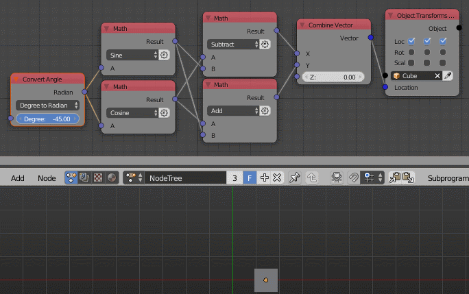

Convert Angle
=============

Description
-----------
This node let you convert from *Degree* to *Radian* or from *Radian* to *Degree*.

.. image:: images/convert_angle_node.png

Inputs
------
 
- **Degree/Radian** - The angle to convert.

Outputs
-------

- **Degree/Radian** - The converted angle.

Advanced Node Settings
----------------------

- N/A

Examples of Usage
-----------------

