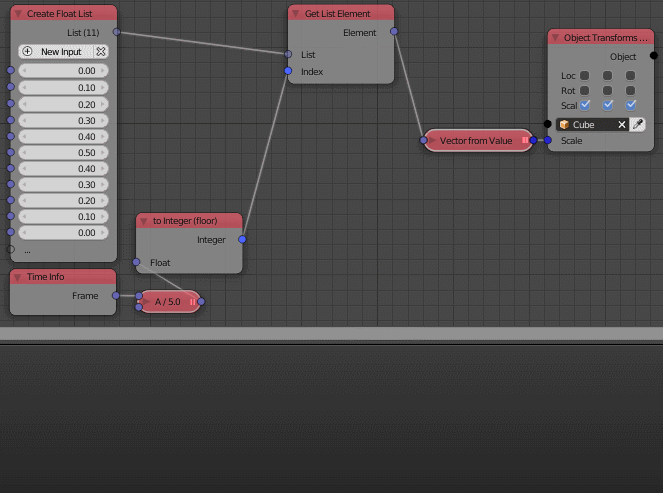

Float List
==========

Description
-----------
This node is used to create an arbitrary list of floats. A new float can be added with the *New Input* button. A new float can also be added by plugging it into the transperant socket.

.. image:: float_list.png

Inputs
------

- **Float** - A float at the index 0.
- **Float** - A float at the index 1.
- **Float** - ...

Outputs
-------
- **Float list** - A list that contain all the input floats.

Advanced Node Settings
-----------------------

- **Change type** - Change the type of the float list to another list type.
- **Hide Inputs** - Hide all the inputs in the node.
- **Remove Inputs** - Remove all the inputs.

Caution
-------
A warning pop up when you use the *Remove All* button in the node, while if you used the the *Remove All* button in the *Advanced Node Settings* the inputs will be removed without a warning.

Examples of Usage
-----------------

