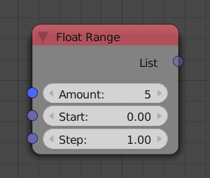
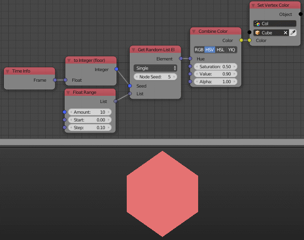

Float Range
===========

Description
-----------
This node is used to generate an list of floats between 2 floats. It supports a custom step size which define the difference between floats in the list.

Inputs
------

- **Amount** - The length of the generated list, It can also be the end float from another point of view.
- **Start** - It is the float where the list should start.
- **Step** - It is the difference between each float. So if the *Step* is equal to 2.0, every integer will be bigger than the previouse by 2.0.

Outputs
-------
- **Float List** - A float list that contains the generated floats.

Advanced Node Settings
-----------------------

- N/A

Examples of Usage
-----------------

