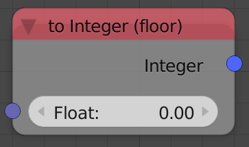
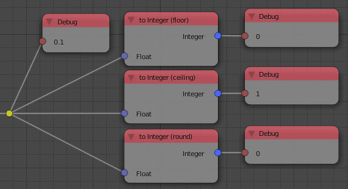

To Integer
==========

Description
-----------
This node converts floats into integers using one of 3 algorithms. (See advanced node settings)

Inputs
------

- **Float** - A float to convert to integer.

Outputs
-------

- **Integer** - Output as integer.

Advanced Node Settings
----------------------

The node has 3 algorithms to do the conversion:

- **Floor** - It returns only the whole number.
- **Ceiling** - It returns the next whole number.
- **Round** - Standard round operation, Where *floor* is used if the fraction is less than 0.5 and *ceiling* is used if the fraction is larger than 0.5.

Examples of Usage
-----------------

