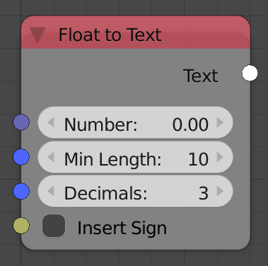
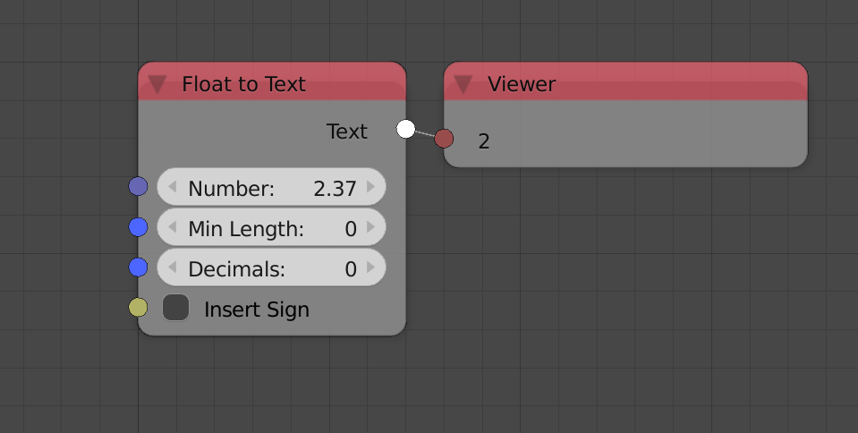

Float To Text
=============

Description
-----------

This node forms a text out of a number.

Inputs
------

- **Number** - The number to be converted.
- **Min Length** - The minimum number of numbers in the output text. If The number is too short, zeroes are inserted to the left of the number to match the input minimum.
- **Decimals** - The number of decimals in the number, if it exceed the number of bytes of the input number, zeroes are inserted at the end.
- **Insert Sign** - A boolean which if true, a plus sign will be added to the left of the number if it was positive.

Outputs
-------

- **Text** - The output text.

Advanced Node Settings
----------------------

- N/A

Examples of Usage
-----------------

