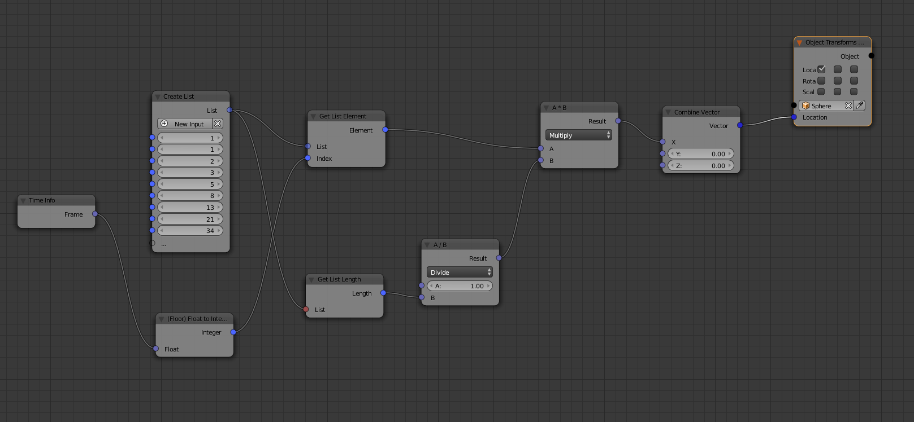

Integer List
==================

In the **Integer List** Node you can define an arbitrary list of integers. The number of the list elements can be increased with the New Input button or decreased in the properties panel (press n) node section.

You can acces an element with it's index, using the **Get List Element** node. The length of the list can be retrived with **Get List length** node.

The example below pass the numbers from the Fibonacci sequence to x coordinate of the "Sphere" object, frame by frame, using the reciprocal of the list length to decrease the Speed.

