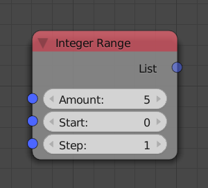

Integer Range
=============

Description
-----------

This node is used to generate an integer list that represents an integer arithmetic sequence.

Inputs
------

- **Amount** - The length of the arithmetic sequence which is also the length of the output integer list.
- **Start** - It is the starting integer of the arithmetic sequence.
- **Step** - The difference between each two consecutive terms in the sequence.

Outputs
-------

- **Integer list** - An integer list that contains the generated integers.

Advanced Node Settings
----------------------

- N/A

Examples of Usage
-----------------

.. image:: gifs/integer_range_example_1.gif
